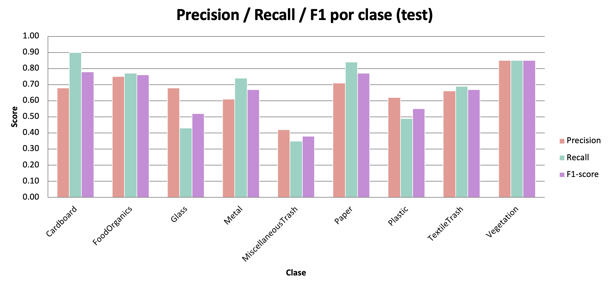

## Fase 3 — Refinamiento del modelo 

Clasificación de imágenes de residuos en **9 categorías** con Keras/TensorFlow. Este documento toma como linea base lo realizado en la Fase 2 para hacer el refinamiento del modelo de la Fase 3, un modelo de **transfer learning con MobileNetV2**. Documenta la preparación de datos, el diagnóstico de errores, la mejora iterativa y la evaluación sobre un conjunto de test reservado.

| Fase | Modelo | Accuracy (test) |
|---|---|:---:|
| 2 | CNN desde cero | 0.49 |
| 3 (refinamiento) | Transfer Learning · MobileNetV2 | **0.66** |

---

## Resumen del proyecto

| Aspecto | Fase 2 (CNN) | Fase 3 (Refinamiento · Transfer Learning) |
|---|---|---|
| **Modelo** | CNN secuencial desde cero | MobileNetV2 preentrenada (ImageNet) |
| **Resolución** | 150 × 150 × 3 | 224 × 224 × 3 |
| **Accuracy (test)** | 0.49 | **0.66** |
| **Macro F1 (test)** | 0.48 | **0.66** |
| **Weighted F1 (test)** | 0.48 | **0.65** |

En la **Fase 2** se construyó una CNN desde cero como línea base: su accuracy en validación pasó de 0.25 (modelo inicial) a 0.53 (modelo final con `class_weight`), y en test alcanzó 0.49. En la **Fase 3** se mejoró el modelo cambiando a *transfer learning* con MobileNetV2 preentrenada en ImageNet, elevando la accuracy de test a 0.66 (una mejora de 17 puntos). En ambas fases, el F1 *macro* y *weighted* se mantienen casi idénticos, señal de un modelo balanceado que no abandona las clases minoritarias para inflar la métrica global.

---

## RealWaste — Clasificación de residuos con Transfer Learning con MobileNetV2

El refinamiento consistió en **cambiar la arquitectura** en lugar de seguir optimizando la CNN, que ya había tocado su techo en 0.49. La decisión y la elección específica de MobileNetV2 frente a otras redes preentrenadas se fundamentó en el paper original del dataset RealWaste [1]. El refinamiento abarcó dos partes:

1. **Adopción de MobileNetV2 con base congelada** (transfer learning), que produjo la mejora principal: de 0.49 a **0.66** en test.
2. **Intento de fine-tuning** para exprimir más rendimiento, que reveló el techo de la configuración actual y llevó a conservar el modelo de la primera etapa.

Se parte de MobileNetV2 preentrenada en ImageNet (más de un millón de imágenes) y se adapta al problema de residuos.

### ¿Por qué MobileNetV2? 

La elección se fundamenta en el paper original del dataset RealWaste [1], que evaluó cinco arquitecturas preentrenadas. Sus resultados en test fueron:

| Modelo | Accuracy | Parámetros |
|---|:---:|:---:|
| Inception V3 | 89.19 % | ~26 M |
| DenseNet121 | 89.19 % | ~7 M |
| **MobileNetV2** | **88.15 %** | **~2 M** |
| InceptionResNet V2 | 87.32 % | ~58 M |
| VGG-16 | 85.65 % | ~34 M |

MobileNetV2 alcanzó 88.15 %, a menos de un punto del mejor (Inception V3), pero con aproximadamente 13× menos parámetros. Esa eficiencia lo hace ideal para entrenar en un entorno con recursos limitados por ser gratiuitos como Google Colab, manteniendo además comparabilidad directa con el paper de referencia. Por eso se eligió frente a alternativas más pesadas.

### Configuración

El transfer learning se realizó en **dos etapas**, siguiendo la metodología del paper [1]:

1. **Etapa 1 — base congelada.** Se cargó MobileNetV2 sin su capa de clasificación (`include_top=False`) y con los pesos de ImageNet (`weights='imagenet'`). La base se congeló (`trainable=False`) y solo se entrenaron capas nuevas: `GlobalAveragePooling2D`, `Dropout` y dos `Dense` (la última con 9 salidas *softmax*). Learning rate `1e-3` [2].
2. **Etapa 2 — fine-tuning.** Se descongelaron las últimas capas de la base y se reentrenó con un learning rate muy bajo (`1e-5`) para afinar sin destruir el conocimiento preentrenado.

| Hiperparámetro | Valor |
|---|---|
| Base | MobileNetV2 (ImageNet) |
| Resolución | 224 × 224 (nativa de MobileNetV2) [2]|
| Preprocesamiento | `preprocess_input` de MobileNetV2 (rango [-1, 1]) |
| Cabeza | GlobalAveragePooling2D → Dropout(0.3) → Dense(128) → Dropout(0.3) → Dense(9) |
| Optimizador / LR | Adam · 1e-3 (etapa 1), 1e-5 (fine-tuning) |
| Class weights | `'balanced'` (igual que en la CNN de la Fase 2) |

> **Detalle de preprocesamiento:** a diferencia de la CNN de la Fase 2 (que usaba `rescale=1./255`, rango [0,1]), MobileNetV2 requiere su propia función `preprocess_input`, que normaliza al rango [-1, 1] [2]. Usar el preprocesamiento equivocado degrada el modelo preentrenado, así que se aplicó el correcto en los tres generadores (train, validation y test).

### Resultados

El mejor modelo alcanzó **0.69 de accuracy en validación** y **0.66 en test** — frente al 0.49 de la CNN. La pequeña diferencia validación→test (0.69 → 0.66) vuelve a ser pequeña y esperada, confirmando que el modelo generaliza de forma consistente.

*Figura 1. Precision, recall y F1-score por clase en el conjunto de test (MobileNetV2).*

| Clase | Precision | Recall | F1-score | Soporte |
|---|:---:|:---:|:---:|:---:|
| Cardboard | 0.68 | 0.90 | 0.78 | 69 |
| FoodOrganics | 0.75 | 0.77 | 0.76 | 62 |
| Glass | 0.68 | 0.43 | 0.52 | 63 |
| Metal | 0.61 | 0.74 | 0.67 | 118 |
| MiscellaneousTrash | 0.42 | 0.35 | 0.38 | 74 |
| Paper | 0.71 | 0.84 | 0.77 | 75 |
| Plastic | 0.62 | 0.49 | 0.55 | 139 |
| TextileTrash | 0.66 | 0.69 | 0.67 | 48 |
| Vegetation | 0.85 | 0.85 | 0.85 | 66 |
| **accuracy** | | | **0.66** | 714 |
| **macro avg** | 0.66 | 0.67 | 0.66 | 714 |
| **weighted avg** | 0.65 | 0.66 | 0.65 | 714 |

## Curva de entrenamiento

*Figura 2. Curvas de accuracy de entrenamiento y validación del modelo MobileNetV2 a lo largo de los epochs.*

La curva de train asciende de forma sostenida desde 0.49 hasta aproximadamente 0.84 en los epochs finales, mientras que la de validation se mueve de forma ruidosa entre 0.54 y 0.69 sin acompañar ese ascenso. La brecha creciente entre ambas refleja overfitting: el modelo mejora su ajuste al entrenamiento más rápido de lo que mejora su capacidad de generalizar.

Sin embargo, gracias al conocimiento previo de MobileNetV2 la validación se mantiene en un nivel alto y estable (en torno a 0.65–0.69) en lugar de estancarse abajo como ocurría con la CNN desde cero. El máximo, 0.691, se alcanza en el epoch 15. El EarlyStopping detuvo el entrenamiento en el epoch 22 (al no mejorar la val_acc durante 7 epochs seguidos) y el ModelCheckpoint conservó el modelo del epoch 15, que constituye el modelo final de esta fase. Su desempeño en el conjunto de test independiente fue de 0.66, confirmando que generaliza de forma consistente.

### Intento de fine-tuning y su techo

Como segunda parte del refinamiento —ajustar más a fondo la arquitectura (se intentó la etapa 2 de fine-tuning en dos ocasiones), descongelando capas de la base preentrenada para afinarlas al problema de residuos:

- **Primer intento — descongelar ~54 capas.** El modelo **empeoró**: la val_acc cayó de 0.69 a 0.65. Mientras el train accuracy seguía subiendo (hacia 0.80), el de validación bajaba época a época. Con un dataset pequeño (aproximadamente 3 300 imágenes), descongelar tantas capas le dio al modelo capacidad para memorizar el entrenamiento en lugar de generalizar mejor.
- **Segundo intento — descongelar solo ~24 capas (learning rate 1e-5).** Esté fue el mejor resultado del refinamiento, ya **no empeoró**, pero **tampoco superó** la etapa 1: se quedó en 0.685, prácticamente igual al 0.69 de partida.

La conclusión del refinamiento es clara: con la configuración actual (resolución 224 × 224 y el aumento de datos empleado), el modelo alcanzó su "techo de rendimiento". En las dos corridas de fine-tuning la val_acc se estancó en el rango 0.65–0.69 sin importar cuántas capas se descongelaran ni cuánto se entrenara. Por esa razón, el **modelo final conservado es el de la etapa 1** (base congelada): 0.69 en validación y 0.66 en test. Superar ese techo no requiere más fine-tuning, sino cambios más profundos como subir la resolución a 524 × 524, como en el paper.

> Que el fine-tuning no mejorara no es un fracaso, sino un hallazgo del proceso de refinamiento: identifica dónde está el límite real (los datos y la resolución) y descarta el ajuste fino como vía de mejora con esta configuración.

### Sobre la diferencia con el paper (0.66 vs 0.88)

El paper alcanzó 88% con MobileNetV2 y este proyecto 66%, usando la misma arquitectura. La diferencia no está en el modelo, sino en tres decisiones de la metodología del paper que aquí no se replicaron por completo:

1. **Resolución de imagen.** El paper usó **524 × 524**; aquí se usó 224 × 224. Los autores justifican la alta resolución por los objetos transparentes (vidrio, plástico) y los materiales mezclados, que necesitan detalle fino para distinguirse [1]. Este es probablemente el factor de mayor peso.
2. **Data augmentation.** El paper triplicó su dataset con transformaciones geométricas específicas usando la librería Augmentor [1]; aquí se usó un aumento más básico.
3. **Fine-tuning progresivo más extenso**, con learning rates ajustados por etapa.

Reconocer estas diferencias no resta valor al resultado: el objetivo de esta fase era demostrar la mejora del transfer learning sobre la CNN base (lograda: +17 puntos), no replicar exactamente el paper. Subir la resolución a 524 × 524 sería el siguiente paso, a costa de un entrenamiento considerablemente más lento y exigente en memoria.

---

## Comparación final: CNN vs Transfer Learning

*Figura 3. Comparación de la accuracy en test entre la CNN desde cero (Fase 2) y el modelo de transfer learning MobileNetV2 (Fase 3).*

El transfer learning superó a la CNN desde cero en **accuracy global** (0.49 → 0.66) y en **casi todas las clases** individualmente:

*Figura 4. F1-score por clase en test: CNN desde cero vs transfer learning.*

| Clase | CNN (F1) | Transfer Learning (F1) | Δ |
|---|:---:|:---:|:---:|
| Cardboard | 0.63 | 0.78 | +0.15 |
| FoodOrganics | 0.52 | 0.76 | +0.24 |
| Glass | 0.29 | 0.52 | +0.23 |
| Metal | 0.33 | 0.67 | +0.34 |
| MiscellaneousTrash | 0.42 | 0.38 | −0.04 |
| Paper | 0.74 | 0.77 | +0.03 |
| Plastic | 0.45 | 0.55 | +0.10 |
| TextileTrash | 0.20 | 0.67 | +0.47 |
| Vegetation | 0.77 | 0.85 | +0.08 |
| **Accuracy global** | **0.49** | **0.66** | **+0.17** |

*Figura 5. Matriz de confusión del modelo MobileNetV2 sobre el conjunto de test.*

Las mejoras más grandes están en las clases que la CNN apenas reconocía: **TextileTrash** (+0.47) y **Metal** (+0.34). Tiene sentido ya que son clases con pocas muestras o de apariencia compleja, donde el conocimiento previo de MobileNetV2 (que ya sabe reconocer texturas y formas) marca la mayor diferencia. La única clase que no mejoró fue **MiscellaneousTrash** (−0.04), esto se debe a la dificultad de agrupa objetos sin un patrón visual común; ni el preentrenamiento ayuda mucho ahí.

---

## Conclusiones

**1. El diagnóstico vale más que la complejidad.** A lo largo del proyecto quedó claro que mejorar el modelo no consistía en hacerlo más grande, sino en entender qué estaba fallando. El mayor avance no vino de agregar más capas a la red (de hecho, pasar de 2 a 4 bloques apenas cambió el resultado), sino de dos decisiones puntuales: corregir un error de normalización que arruinaba la medición y aplicar pesos por clase para compensar el desbalance de datos. Antes de complicar un modelo, conviene revisar si el problema está en los datos o en cómo se están midiendo los resultados.

**2. El `class_weight` fue decisivo.** El conjunto de datos tenía clases con muchas imágenes (como Plastic) y otras con muy pocas (como TextileTrash). Sin ningún ajuste, el modelo tendía a "ignorar" las clases pequeñas porque equivocarse en ellas casi no afectaba su puntuación global. Al asignar más peso a esas clases, el modelo se vio obligado a tomarlas en cuenta. El resultado es un modelo que acierta de forma pareja en todas las categorías y no solo en las más fáciles o más frecuentes. Esto se refleja en que sus dos formas de promediar el rendimiento (macro y weighted) terminan siendo casi iguales.

**3. El transfer learning superó con holgura a la CNN desde cero.** Con cerca de 3 300 imágenes de entrenamiento repartidas en 9 categorías, los datos son limitados para una red que aprende todo desde el inicio. Por eso la CNN se quedó en 0.49: no es un mal resultado para entrenar desde cero, pero sí refleja ese límite. Al partir de MobileNetV2 (que ya "sabe" reconocer formas, texturas y bordes gracias a su preentrenamiento en millones de imágenes) el modelo alcanzó **0.66 en test**, una mejora de 17 puntos, y mejoró en casi todas las clases. Las mayores ganancias se dieron justo en las categorías que la CNN apenas reconocía (TextileTrash, Metal), donde el conocimiento previo aporta más. El refinamiento posterior (fine-tuning, en dos intentos) no logró superar ese 0.69 de validación: el modelo había alcanzado su techo con la resolución y el aumento de datos usados, por lo que se conservó el modelo de la etapa congelada como versión final.

**4. El honesto reconocimiento de los límites es parte del análisis.** El resultado de 0.66 queda por debajo del 0.88 que el paper de RealWaste reporta con la misma arquitectura [1], y la diferencia se explica por decisiones de metodología que no se replicaron (principalmente la resolución de 524 × 524 frente a 224 × 224, y un aumento de datos más elaborado). Documentar *por qué* existe esa brecha —en lugar de ocultarla— es tan valioso como el resultado mismo: demuestra que se entiende qué factores mueven el rendimiento y cuál sería el siguiente paso para cerrarla.

---

## Referencias

[1] S. Single, S. Iranmanesh, and R. Raad, "RealWaste: A Novel Real-Life Data Set for Landfill Waste Classification Using Deep Learning," *Information*, vol. 14, no. 12, art. 633, 2023. doi: 10.3390/info14120633.

[2] Keras, "MobileNet, MobileNetV2, and MobileNetV3 — MobileNetV2 function," Keras API Documentation. [Online]. Available: https://keras.io/api/applications/mobilenet/mobilenet_models/

---

Última actualización: [08 de Junio de 2026]
