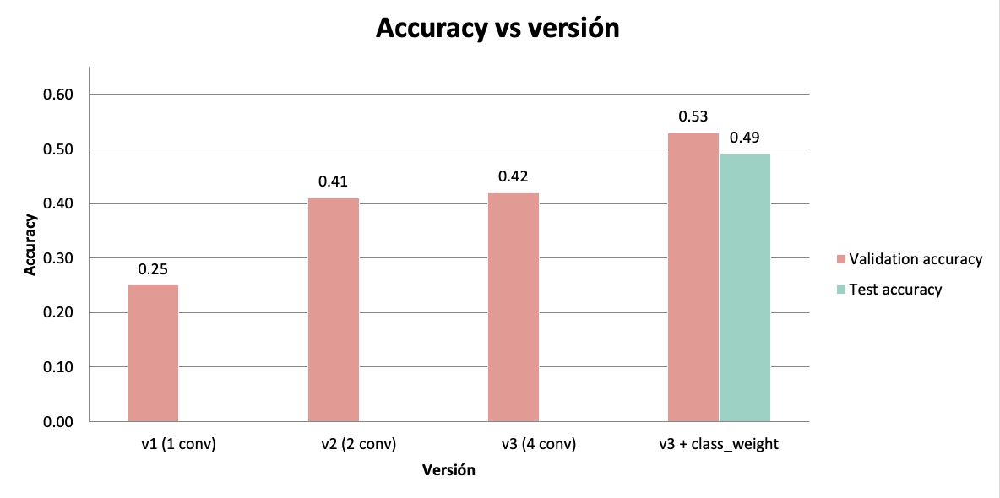
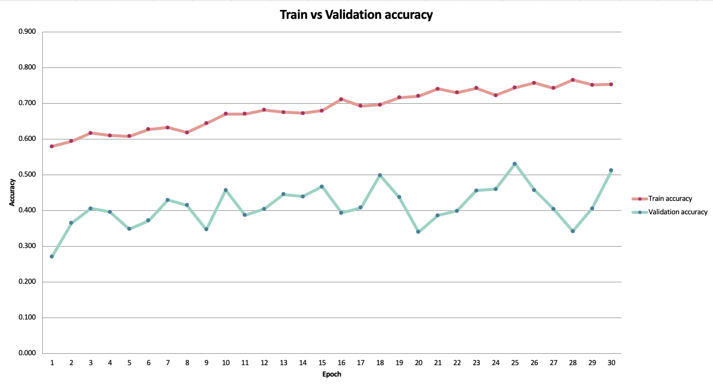
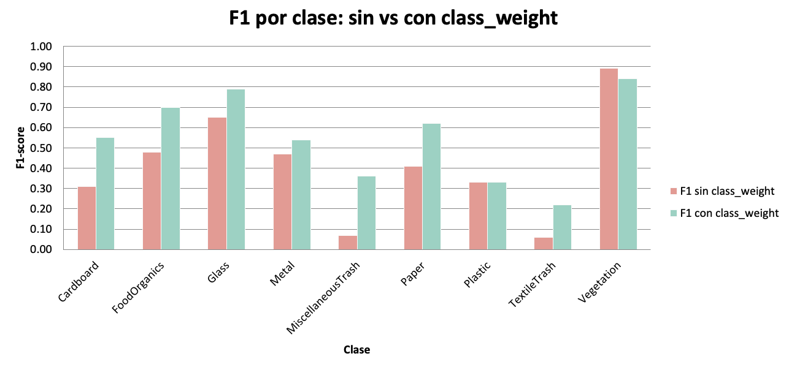
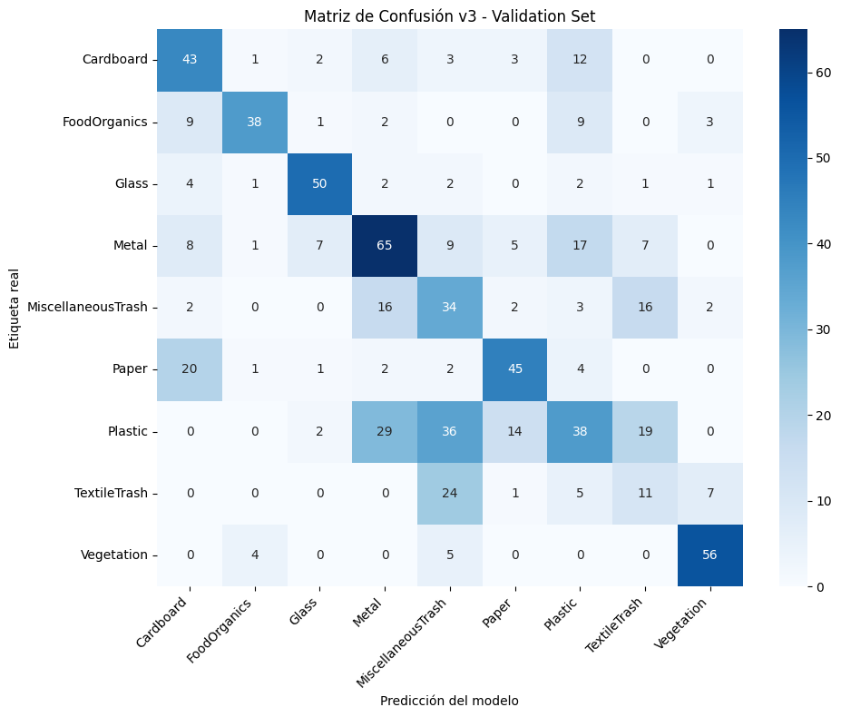
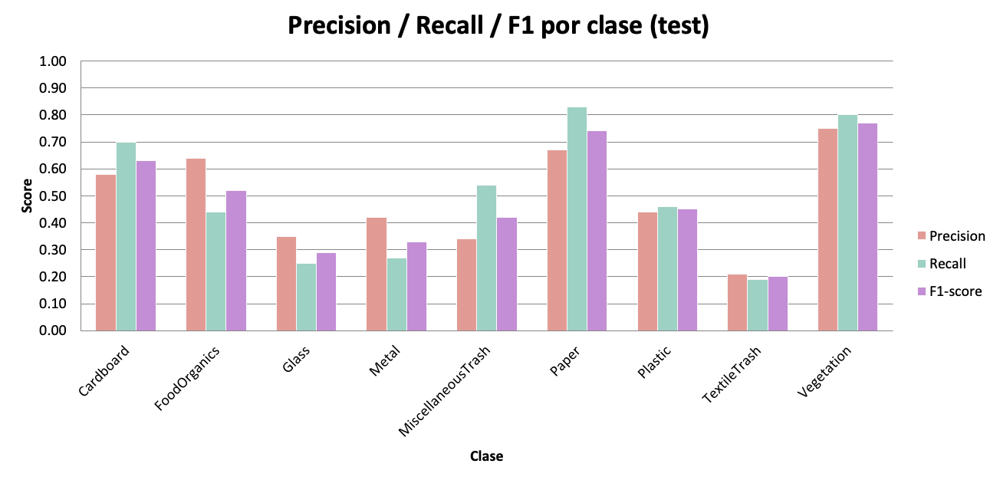

# Fase 2 — Implementación y evaluación del modelo

---

## RealWaste — Clasificación de residuos con CNN

En este reporte se presenta el avance del entrenamiento supervisado por clasificación de imágenes de residuos en 9 categorías mediante una red neuronal convolucional (CNN) con Keras/TensorFlow. El proyecto documenta el ciclo completo de *machine learning*: preparación de datos, entrenamiento, diagnóstico de errores, mejora iterativa y evaluación honesta sobre un conjunto de test reservado.

---

## Resumen del proyecto

A lo largo del entrenamiento, la accuracy en validación pasó de 0.25 (modelo inicial) a 0.53 (modelo final). La evaluación final en el conjunto de test confirmó este resultado con una accuracy de 0.49. El F1 macro y el weighted coinciden en 0.48, lo que indica que el modelo trata a todas las clases por igual y no abandona a las más pequeñas que son normalmente las menos frecuentes para mejorar la métrica global.

---

## Dataset

El dataset está dividido en tres particiones independientes:

| Partición | Imágenes | Uso |
|---|---|---|
| **Train** | 3323 | Aprendizaje |
| **Validation** | 715 | Monitoreo y selección de modelo |
| **Test** | 714 | Evaluación final imparcial |

Las **9 clases** presentan un desbalance muy notorio, lo que es un factor clave en el diseño del entrenamiento:

| Clase | Soporte (test) |
|---|---|
| Cardboard | 69 |
| FoodOrganics | 62 |
| Glass | 63 |
| Metal | 118 |
| MiscellaneousTrash | 74 |
| Paper | 75 |
| Plastic | 139 |
| TextileTrash | 48 |
| Vegetation | 66 |

> Como se puede observar en la tabla **Plastic** tiene casi 3 veces más que las imágenes de **TextileTrash**. Este desbalance motivó el uso de pesos por clase durante el entrenamiento.

---

## Arquitectura del modelo

La arquitectura final (v3) es una CNN de 4 bloques convolucionales seguidos de un clasificador denso:

```python
model = models.Sequential()

model.add(layers.Conv2D(32, (3, 3), activation='relu', input_shape=(150, 150, 3)))
model.add(layers.MaxPooling2D((2, 2)))
model.add(layers.Conv2D(64, (3, 3), activation='relu'))
model.add(layers.MaxPooling2D((2, 2)))
model.add(layers.Conv2D(128, (3, 3), activation='relu'))
model.add(layers.MaxPooling2D((2, 2)))
model.add(layers.Conv2D(128, (3, 3), activation='relu'))
model.add(layers.MaxPooling2D((2, 2)))

model.add(layers.Flatten())
model.add(layers.Dropout(0.5))
model.add(layers.Dense(512, activation='relu'))
model.add(layers.Dense(9, activation='softmax'))
```

**Configuración de entrenamiento:**

| Hiperparámetro | Valor |
|---|---|
| Optimizador | Adam |
| Learning rate | 1e-3 |
| Loss | categorical_crossentropy |
| Batch size | 20 |
| Épocas máximas | 30 |
| Early stopping | `patience=7`, monitor `val_acc`, `restore_best_weights=True` |
| Class weights | `'balanced'` (calculado sobre train) |

---

## Preprocesamiento y aumento de datos

Solo el conjunto de **train** recibe data augmentation, ya que como se mencionó en clase  validación y test usan únicamente el reescalado, para que la evaluación refleje las imágenes reales.

```python
train_datagen = ImageDataGenerator(
    rescale=1./255,
    rotation_range=40,
    width_shift_range=0.2,
    height_shift_range=0.2,
    shear_range=0.2,
    zoom_range=0.2,
    horizontal_flip=True
)

test_datagen, val_datagen = ImageDataGenerator(rescale=1./255)    
```

> ⚠️ **Lección aprendida:** la normalización de validación/test **debe ser idéntica** a la de entrenamiento (`rescale=1./255`). Un error temprano (`ImageDataGenerator(1./255)`, que asigna el valor a `featurewise_center` en lugar de a `rescale`) dejó validación sin normalizar y disparó la `val_loss` a valores de aproximadamente 500. Corregirlo fue la primera gran mejora 🙂.

---

## Proceso de mejora iterativa

### El punto de partida: un bug de normalización

Las primeras corridas arrojaron resultados anómalos, ya que la v1 daba **0.06** de accuracy, la v2 no daba **0.41** que no era un valor tan extraño, pero la v3 daba **0.35** que ese si era un valor muy raro, con métricas degeneradas (clases enteras en 0.00 y recalls sospechosos de 1.00). Ante estos resultados, se revisó el pre-procesado de las imágenes, investigando la causa, se halló un error en el generador de validación:

```python
val_datagen = ImageDataGenerator(1./255)         #  asigna 1./255 a featurewise_center
val_datagen = ImageDataGenerator(rescale=1./255) #  normalización correcta
```

El valor `1./255` se pasaba al parámetro equivocado, por lo que las imágenes de validación llegaban sin normalizar (rango [0,255]) mientras el modelo aprendía con valores normalizados (rango [0,1]). Esto disparaba la `val_loss` a valores de aproximadament 500. Tras la corrección, **las tres versiones se reentrenaron desde cero**; los resultados de la tabla siguiente corresponden ya a esas corridas válidas.

| Versión | Accuracy con bug | Accuracy corregida |
|---|:---:|:---:|
| v1 | 0.06 | **0.25** |
| v2 | 0.41 | **0.41** |
| v3 | 0.35 | **0.42** |

### Evolución de las versiones: normalización del error

Cada cambio se fundamentó en un diagnóstico concreto, no en prueba y error a ciegas.



| Versión | Arquitectura | Val. accuracy | Diagnóstico |
|---|---|:---:|---|
| **v1** | 1 bloque conv + Dense(256), sin Dropout | 0.25 | El punto de partida que es el modelo más simple |
| **v2** | 2 bloques conv (64, 128) + Dropout(0.5) + Dense(256) | 0.41 | Salto al añadir profundidad y regularización |
| **v3** | 4 bloques conv (32-64-128-128) + Dropout(0.5) + Dense(512) | 0.42 | Más capas apenas ayudó (+0.01) y el límite es el overfitting |
| **v3 + class_weight** | v3 con pesos por clase balanceados | **0.53** | Rescata las clases minoritarias, y es el mejor modelo hasta ahora |

**Hallazgo clave:** pasar de 2 a 4 bloques convolucionales (v2 → v3) apenas movió la métrica (+0.01). Esto evidenció que el problema **no era la capacidad del modelo** sino el desbalance de clases y el overfitting. El `class_weight`, aplicado sobre la misma arquitectura v3, fue el cambio de mayor impacto (+0.11).

---

## Curvas de entrenamiento



La curva de *train* asciende de forma sostenida desde 0.58 hasta 0.75 en los epochs finales, mientras que la de *validation* se mueve de forma ruidosa entre 0.27 y 0.53 sin acompañar ese ascenso. La brecha creciente entre ambas refleja **overfitting**: el modelo mejora su ajuste al entrenamiento más rápido de lo que mejora su capacidad de generalizar.

No obstante, no se trata de un overfitting severo (en el que la `val_acc` se desplomaría): la validación se mantiene en una meseta ruidosa cuyo **máximo, 0.531, se alcanza en el epoch 25**. El entrenamiento completó las 30 épocas; el `EarlyStopping` no llegó a activarse porque las mejoras de `val_acc` se producían en menos de 7 epochs hasta el epoch 25— y el `ModelCheckpoint` conservó el modelo de ese epoch, que constituye el modelo final.

---

## El papel del `class_weight`

El dataset desbalanceado provocaba que el modelo ignorara las clases minoritarias más pequeñas como TextileTrash y MiscellaneousTrash quedaban con F1 ≈ 0.06. Al asignar pesos inversamente proporcionales a la frecuencia de cada clase, el modelo pasa a penalizar más los errores en las clases pequeñas.

```python
from sklearn.utils.class_weight import compute_class_weight

cls = train_generator.classes
weights = compute_class_weight('balanced', classes=np.unique(cls), y=cls)
class_weight = dict(enumerate(weights))
```

Pesos resultantes (índice → peso):

| Clase | Peso |
|---|:---:|
| Cardboard | 1.15 |
| FoodOrganics | 1.29 |
| Glass | 1.26 |
| Metal | 0.67 |
| MiscellaneousTrash | 1.07 |
| Paper | 1.05 |
| Plastic | 0.57 |
| TextileTrash | 1.66 |
| Vegetation | 1.21 |

Los decimales salen de la fórmula `balanced`, que calcula:

`peso_clase = total_muestras / (n_clases × muestras_de_esa_clase)`

En este caso de las 3323 imágenes y las 9 clases, tomando de ejemplo a Plastic y TextileTrash:

Plastic tiene muchas imágenes, digamos 644 → peso ≈ 3323/(9×644) ≈ 0.573
TextileTrash tiene pocas, digamos 222 → peso ≈ 3323/(9×222) ≈ 1.663 

Las clases abundantes (Plastic, Metal) reciben peso < 1 por lo que se castiga menos (ya tiene muchos ejemplos) y las escasas (TextileTrash) peso > 1 se castiga más (para que el modelo no la ignore). El efecto sobre el F1 por clase fue notable:



| Clase | F1 sin pesos | F1 con pesos | Δ |
|---|:---:|:---:|:---:|
| TextileTrash | 0.06 | 0.22 | +0.16 |
| MiscellaneousTrash | 0.07 | 0.36 | +0.29 |
| Cardboard | 0.31 | 0.55 | +0.24 |
| FoodOrganics | 0.48 | 0.70 | +0.22 |
| Paper | 0.41 | 0.62 | +0.21 |

---

## Resultados finales en test

| Métrica | Validation | Test |
|---|:---:|:---:|
| Accuracy | 0.53 | **0.49** |
| Macro F1 | 0.55 | **0.48** |
| Weighted F1 | 0.53 | **0.48** |
| Loss | 1.83 | 1.89 |

La diferencia validación → test (0.53 → 0.49) es **pequeña y esperada**: validación estaba ligeramente optimista por haberse usado en el `EarlyStopping`. Una brecha de 4 puntos confirma que el modelo generaliza de forma consistente y que el resultado de validación no era un espejismo.

---

## Matriz de confusión



Las confusiones más frecuentes ocurren entre **Plastic ↔ Metal ↔ MiscellaneousTrash**, materiales que comparten apariencia (superficies brillantes, formas irregulares). **Vegetation** es la clase mejor separada por su distintividad visual.

---

## Análisis por clase



**Métricas completas sobre el conjunto de test:**

| Clase | Precision | Recall | F1-score | Soporte |
|---|:---:|:---:|:---:|:---:|
| Cardboard | 0.58 | 0.70 | 0.63 | 69 |
| FoodOrganics | 0.64 | 0.44 | 0.52 | 62 |
| Glass | 0.35 | 0.25 | 0.29 | 63 |
| Metal | 0.42 | 0.27 | 0.33 | 118 |
| MiscellaneousTrash | 0.34 | 0.54 | 0.42 | 74 |
| Paper | 0.67 | 0.83 | 0.74 | 75 |
| Plastic | 0.44 | 0.46 | 0.45 | 139 |
| TextileTrash | 0.21 | 0.19 | 0.20 | 48 |
| Vegetation | 0.75 | 0.80 | 0.77 | 66 |
| **accuracy** | | | **0.49** | 714 |
| **macro avg** | 0.49 | 0.50 | 0.48 | 714 |
| **weighted avg** | 0.49 | 0.49 | 0.48 | 714 |

**Fortalezas** 
- **Vegetation (0.77)** y **Paper (0.74)**: clases visualmente distintivas.
- **Cardboard (0.63)**: buena recuperación tras aplicar pesos.

**Debilidades** 
- **Glass (0.29)**: los objetos transparentes son difíciles para visión por computadora ("se ven a través").
- **TextileTrash (0.20)**: la clase con menos muestras (48); aún con pesos, le falta material de entrenamiento.
- **Metal (0.33)**: se confunde con Plastic y Miscellaneous.

---

## Conclusiones

1. **El diagnóstico vale más que la complejidad.** El mayor salto no vino de añadir capas, sino de corregir un bug de normalización y atacar el desbalance de clases. A lo largo del proyecto quedó claro que mejorar el modelo no consistía en hacerlo más grande, sino en entender qué estaba fallando. El mayor avance vino de dos decisiones puntuales: corregir un error de normalización que arruinaba la medición y aplicar pesos por clase para compensar el desbalance de datos. Antes de complicar un modelo, conviene revisar si el problema está en los datos o en cómo se están midiendo los resultados.

2. **El `class_weight` fue decisivo** El conjunto de datos tenía clases con muchas imágenes (como Plastic) y otras con muy pocas (como TextileTrash). Sin ningún ajuste, el modelo tendía a "ignorar" las clases pequeñas porque equivocarse en ellas casi no afectaba su puntuación global.

3. **0.49 en test es un resultado sólido para una CNN desde cero** Con cerca de 3 300 imágenes de entrenamiento repartidas en 9 categorías, los datos disponibles son limitados para una red que aprende todo desde el inicio, sin ningún conocimiento previo. En ese contexto, acertar prácticamente la mitad de las veces es un punto de partida razonable y honesto.

## Material del curso

Este proyecto se apoyó en los notebooks de ejemplo del curso [NOMBRE OFICIAL DEL CURSO]:

- División train/validation/test y diagnóstico de overfitting/underfitting — notebook Examples_under_over_and_split_val_train_test.
- Aumento de datos y generadores de imágenes (ImageDataGenerator, flow_from_directory, target_size=(150,150)) — notebook Data_augmentation.
- Regularización con Dropout, guardado del mejor modelo (ModelCheckpoint) y parada temprana (EarlyStopping) — notebook Callbacks_for_saving_models.
- Arquitectura base de la CNN y ajuste de hiperparámetros — notebook Model_Tunning.
- Estructura de evaluación en test — ejemplo Cats_and_Dogs_Keras.

## Referencias (IEEE)

[1] S. Single, S. Iranmanesh, and R. Raad, "RealWaste: A Novel Real-Life Data Set for Landfill Waste Classification Using Deep Learning," Information, vol. 14, no. 12, art. 633, 2023. doi: 10.3390/info14120633.

[2] scikit-learn, "sklearn.utils.class_weight.compute_class_weight," scikit-learn Documentation. [Online]. Available: https://scikit-learn.org/stable/modules/generated/sklearn.utils.class_weight.compute_class_weight.html

Última actualización: [31 de Mayo de 2026]
