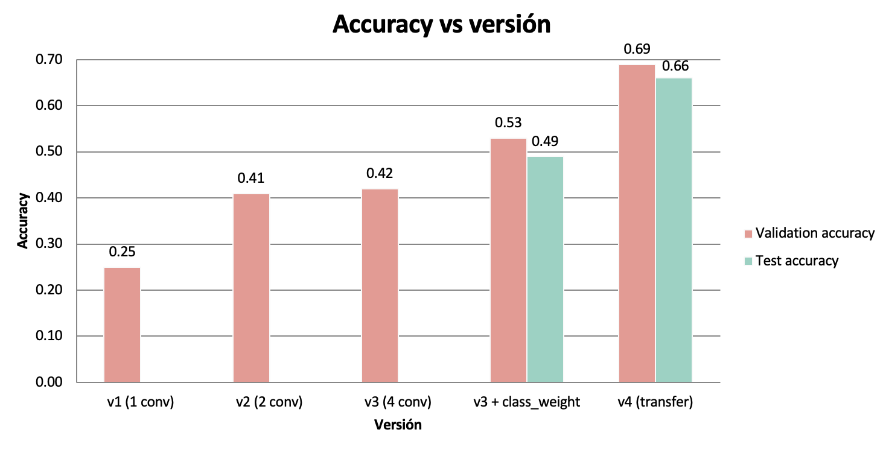
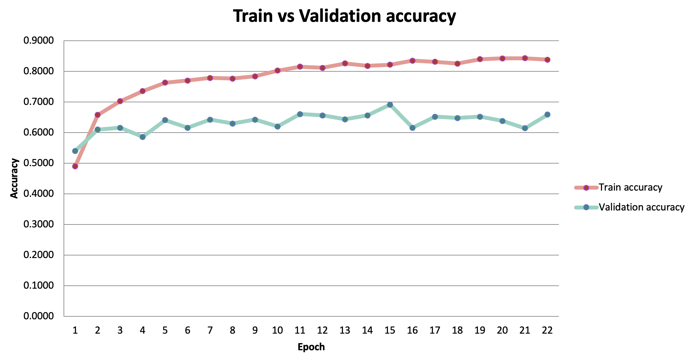
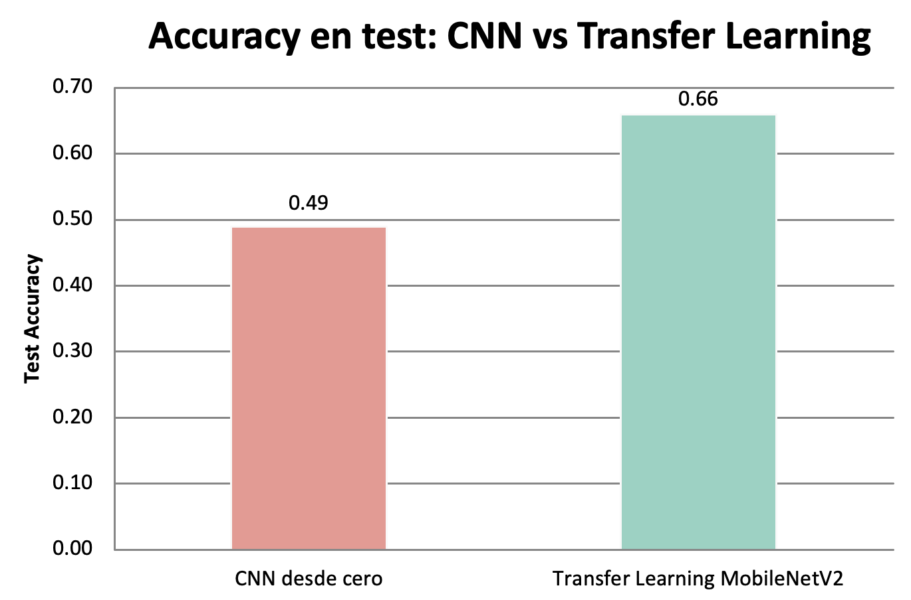
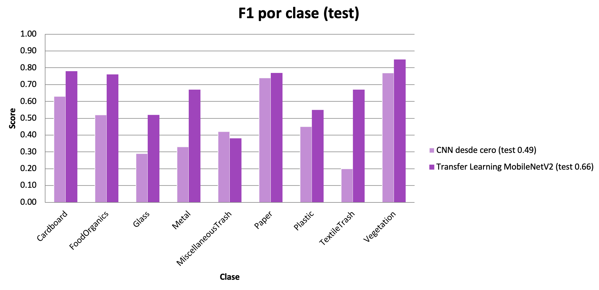
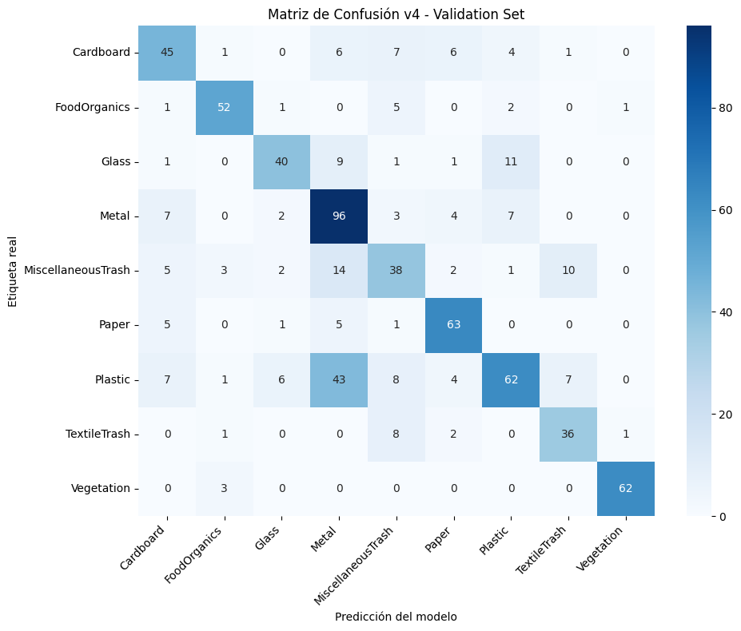

# RealWaste — Clasificación de residuos con Deep Learning

Proyecto de clasificación de imágenes de residuos en **9 categorías** (Cardboard, FoodOrganics, Glass, Metal, MiscellaneousTrash, Paper, Plastic, TextileTrash y Vegetation) usando el dataset **RealWaste** y Keras/TensorFlow.

Este repositorio reúne el desarrollo completo del proyecto a lo largo de sus fases: desde la preparación de los datos hasta el refinamiento del modelo mediante *transfer learning*. El recorrido va de una **CNN entrenada desde cero** (línea base, 0.25 el modelo más básico en train) a un modelo de **transfer learning con MobileNetV2** (0.69 en train), documentando en cada paso las decisiones de diseño, los errores diagnosticados y la evaluación sobre un conjunto de test reservado.

## Contenido del repositorio

| Fase | Contenido | Modelo | Accuracy (test) |
|---|---|---|:---:|
| **Fase 1** | Selección y preprocesado del dataset | — | — |
| **Fase 2** | CNN desde cero + `class_weight` | CNN secuencial | 0.49 |
| **Fase 3** | Refinamiento con transfer learning | MobileNetV2 | **0.66** |

## Estructura del proyecto

```
.
├── README.md            Reporte (las 3 fases)
├── assets/              Gráficas y figuras del reporte
├── modelos/             Modelos entrenados (.keras)
│   ├── best_model_v3.keras   (CNN, Fase 2)
│   └── best_model_v4.keras   (MobileNetV2, Fase 3)
├── colabs/              Notebooks de entrenamiento
├── prueba/              Notebook para probar el modelo final
└── paper/               Paper original de RealWaste
```

---

# Fase 1 — Preprocesado de Datos

---
## 1.1 Resumen

Esta primera fase del proyecto se enfoca en la **generación/selección del set de datos** y el **preprocesado** previo al entrenamiento del modelo.

---

## 1.2 Selección del Dataset

### ¿Por qué RealWaste?

Inicialmente se contempló trabajar con un dataset de imágenes de microscopía de fluorescencia para segmentación de patógenos. Sin embargo, este dataset presentaba múltiples complicaciones:

- Las imágenes estaban en formato `.tif`, que requiere librerías especializadas (`tifffile`) para su manejo en Colab.
- El problema era de **segmentación** (etiqueta por píxel), no de **clasificación** (etiqueta por imagen).
- El dataset incluía estructura compleja (imágenes sintéticas vs reales, with/without fungi).

Por estas razones se optó por [**RealWaste**](https://www.mdpi.com/2078-2489/14/12/633), un dataset publicado por la Universidad de Wollongong (Australia) con **4,752 imágenes** clasificadas en **9 categorías** de residuos. Sus ventajas:

- Formato JPG estándar, soportado nativamente por TensorFlow/Keras.
- Tamaño uniforme de **524×524 píxeles**.
- Tarea clara de clasificación multi-clase.
- Tamaño manejable para entrenar en Colab.

### Distribución de clases

| Clase | Imágenes | % |
|---|---:|---:|
| Plastic | 921 | 19.4% |
| Metal | 790 | 16.6% |
| Paper | 500 | 10.5% |
| Miscellaneous Trash | 495 | 10.4% |
| Cardboard | 461 | 9.7% |
| Vegetation | 436 | 9.2% |
| Glass | 420 | 8.8% |
| Food Organics | 411 | 8.6% |
| Textile Trash | 318 | 6.7% |
| **TOTAL** | **4,752** | **100%** |

Se observa un **desbalance importante**: Plastic tiene casi 3× más imágenes que Textile Trash. Se considerará en fases posteriores el uso de `class_weight` durante el entrenamiento.

---

## 1.3 División Train / Validation / Test

### ¿Por qué tres conjuntos en lugar de dos?

Aunque el enunciado pedía solo train y test, se decidió usar **tres conjuntos**:

- **Train:** el modelo aprende patrones.
- **Validation:** ajustar hiperparámetros y monitorizar overfitting durante el entrenamiento.
- **Test:** "prueba final" — solo se usa al final para reportar la métrica honesta.

Si se usara el test set para ajustar hiperparámetros, el modelo terminaría "optimizado" para ese conjunto y la accuracy reportada no reflejaría su verdadero desempeño.

### ¿Por qué 70/15/15 y no 80/10/10?

Para datasets en el rango 1,000–10,000 imágenes, **70/15/15 es preferible** porque la clase minoritaria sería demasiado pequeña con 80/10/10.** Textile Trash, con solo 318 imágenes, quedaría con:
- 80/10/10: 32 imágenes en validation/test.
- 70/15/15: 48 imágenes en validation/test.

El 70/15/15 se respetó **dentro de cada clase**, no sobre el dataset completo. Esto garantiza que cada split mantenga la misma proporción relativa de clases que el dataset original.

| Clase | Train | Val | Test | Total |
|---|---:|---:|---:|---:|
| Cardboard | 322 | 70 | 69 | 461 |
| FoodOrganics | 287 | 62 | 62 | 411 |
| Glass | 294 | 63 | 63 | 420 |
| Metal | 553 | 119 | 118 | 790 |
| MiscellaneousTrash | 346 | 75 | 74 | 495 |
| Paper | 350 | 75 | 75 | 500 |
| Plastic | 644 | 138 | 139 | 921 |
| TextileTrash | 222 | 48 | 48 | 318 |
| Vegetation | 305 | 65 | 66 | 436 |
| **TOTAL** | **3,323** | **715** | **714** | **4,752** |

### Estructura física de carpetas

Se reorganizó para ser compatible con `flow_from_directory` de Keras (primero el split, después las clases):

```
RealWaste/
├── train/
│   ├── Cardboard/        (322 imágenes)
│   ├── FoodOrganics/     (287 imágenes)
│   └── ... (9 clases)
├── validation/
│   └── (mismas 9 clases)
└── test/
    └── (mismas 9 clases)
```
---

## 1.4 Preprocesado de los Datos

### Librerías

```python
import os
import numpy as np
import matplotlib.pyplot as plt
import tensorflow as tf
from tensorflow.keras.preprocessing.image import ImageDataGenerator
```

- **`os`**: rutas, listar archivos, crear carpetas.
- **`numpy`**: manipulación de arreglos numéricos.
- **`matplotlib.pyplot`**: visualización de imágenes.
- **`tensorflow`**: framework de deep learning.
- **`ImageDataGenerator`**: clase central — escalamiento, augmentation, lectura desde carpetas, entrega en batches.

### Escalamiento de píxeles

Las imágenes vienen con valores [0, 255]. Se aplicó normalización min-max:

```
pixel_escalado = pixel_original / 255
```

Esto lleva los valores al rango **[0, 1]**, necesario para:

- **Estabilidad del entrenamiento:** evita gradientes desproporcionados.
- **Coherencia entre features:** ninguna característica domina por escala.

Se aplica a **train, validation y test** porque el modelo debe ver el mismo rango.

### Hiperparámetros principales

| Parámetro | Valor | Justificación |
|---|---|---|
| `target_size` | (150, 150) | ~12× más rápido que 524×524, sin pérdida significativa. |
| `batch_size` | 20 | Gradientes estables, bajo uso de RAM.  |
| `class_mode` | `'categorical'` | 9 clases → vector one-hot. Implica `categorical_crossentropy` y `softmax` en la capa de salida. |

---

## 1.5 Data Augmentation

### ¿Qué es y por qué se aplica?

Aplicación de transformaciones aleatorias a las imágenes durante el entrenamiento para generar variaciones artificiales. Cada época el modelo ve versiones diferentes, lo cual:

- **Reduce overfitting** (no se memorizan imágenes exactas).
- **Mejora generalización** (reconoce objetos en distintas orientaciones, posiciones, escalas).
- **Compensa el tamaño limitado del dataset.**

Las transformaciones se aplican al vuelo en RAM, sin guardar archivos.

### Diferencia crítica: train vs validation/test

| Set | Augmentation | Rescale |
|---|:---:|:---:|
| Train |  Sí |  Sí |
| Validation |  No |  Sí |
| Test |  No |  Sí |

**Validation:** sin augmentation porque la métrica debe ser estable entre épocas. Si aplicáramos transformaciones, no sabríamos si una mejora viene del modelo o del azar.

**Test:** sin augmentation porque la métrica final debe reflejar el desempeño en imágenes reales, no en versiones artificiales.

**Rescale en los 3:** el modelo aprendió con valores [0, 1]; debe ver el mismo rango en evaluación.Sin embargo, el rescalamineto de test se hace al final, en la etapa de evaluación.

---

# Fase 2 — Implementación y evaluación del modelo

---

## 2.1 RealWaste — Clasificación de residuos con CNN

En esta segunda fase se presenta el avance del entrenamiento supervisado por clasificación de imágenes de residuos en 9 categorías mediante una red neuronal convolucional (CNN) con Keras/TensorFlow. El proyecto documenta el ciclo completo de *machine learning*: preparación de datos, entrenamiento, diagnóstico de errores, mejora iterativa y evaluación honesta sobre un conjunto de test reservado.

---

## 2.2 Resumen 

A lo largo del entrenamiento, la accuracy en validación pasó de 0.25 (modelo inicial) a 0.53 (modelo final). La evaluación final en el conjunto de test confirmó este resultado con una accuracy de 0.49. El F1 macro y el weighted coinciden en 0.48, lo que indica que el modelo trata a todas las clases por igual y no abandona a las más pequeñas que son normalmente las menos frecuentes para mejorar la métrica global.

---

## 2.3 Arquitectura del modelo

La arquitectura final (v3) es una CNN de 4 bloques convolucionales seguidos de un clasificador denso:

```python
model = models.Sequential()

model.add(layers.Conv2D(32, (3, 3), activation='relu', input_shape=(150, 150, 3)))
model.add(layers.MaxPooling2D((2, 2)))
model.add(layers.Conv2D(64, (3, 3), activation='relu'))
model.add(layers.MaxPooling2D((2, 2)))
model.add(layers.Conv2D(128, (3, 3), activation='relu'))
model.add(layers.MaxPooling2D((2, 2)))
model.add(layers.Conv2D(128, (3, 3), activation='relu'))
model.add(layers.MaxPooling2D((2, 2)))

model.add(layers.Flatten())
model.add(layers.Dropout(0.5))
model.add(layers.Dense(512, activation='relu'))
model.add(layers.Dense(9, activation='softmax'))
```

**Configuración de entrenamiento:**

| Hiperparámetro | Valor |
|---|---|
| Optimizador | Adam |
| Learning rate | 1e-3 |
| Loss | categorical_crossentropy |
| Batch size | 20 |
| Épocas máximas | 30 |
| Early stopping | `patience=7`, monitor `val_acc`, `restore_best_weights=True` |
| Class weights | `'balanced'` (calculado sobre train) |

---

## 2.4 Preprocesamiento y aumento de datos

Solo el conjunto de **train** recibe data augmentation, ya que como se mencionó en clase  validación y test usan únicamente el reescalado, para que la evaluación refleje las imágenes reales.

```python
train_datagen = ImageDataGenerator(
    rescale=1./255,
    rotation_range=40,
    width_shift_range=0.2,
    height_shift_range=0.2,
    shear_range=0.2,
    zoom_range=0.2,
    horizontal_flip=True
)

test_datagen, val_datagen = ImageDataGenerator(rescale=1./255)    
```

> ⚠️ **Lección aprendida:** la normalización de validación/test **debe ser idéntica** a la de entrenamiento (`rescale=1./255`). Un error temprano (`ImageDataGenerator(1./255)`, que asigna el valor a `featurewise_center` en lugar de a `rescale`) dejó validación sin normalizar y disparó la `val_loss` a valores de aproximadamente 500. Corregirlo fue la primera gran mejora 🙂.

---

## 2.5 Proceso de mejora iterativa

### El punto de partida: un bug de normalización

Las primeras corridas arrojaron resultados anómalos: la v1 daba **0.06** de accuracy y la v3 daba **0.35**, un valor muy raro para una red más profunda, con métricas degeneradas (clases enteras en 0.00 y recalls sospechosos de 1.00). Ante estos resultados se revisó el preprocesado de las imágenes y, al investigar la causa, se halló un error en el generador de validación:

```python
val_datagen = ImageDataGenerator(1./255)         #  asigna 1./255 a featurewise_center
val_datagen = ImageDataGenerator(rescale=1./255) #  normalización correcta
```

El valor `1./255` se pasaba al parámetro equivocado, por lo que las imágenes de validación llegaban sin normalizar (rango [0,255]) mientras el modelo aprendía con valores normalizados (rango [0,1]). Esto disparaba la `val_loss` a valores de aproximadamente 500. Tras la corrección, **las tres versiones se reentrenaron desde cero**; los resultados de la tabla siguiente corresponden ya a esas corridas válidas.

| Versión | Accuracy con bug | Accuracy corregida |
|---|:---:|:---:|
| v1 | 0.06 | **0.25** |
| v2 | 0.41 | **0.41** |
| v3 | 0.35 | **0.42** |

### Evolución de las versiones: normalización del error

Cada cambio se fundamentó en un diagnóstico concreto, no en prueba y error a ciegas.


*Figura 1. Evolución de la accuracy de validación a través de las versiones de la CNN (Fase 2).*

| Versión | Arquitectura | Val. accuracy | Diagnóstico |
|---|---|:---:|---|
| **v1** | 1 bloque conv + Dense(256), sin Dropout | 0.25 | El punto de partida que es el modelo más simple |
| **v2** | 2 bloques conv (64, 128) + Dropout(0.5) + Dense(256) | 0.41 | Salto al añadir profundidad y regularización |
| **v3** | 4 bloques conv (32-64-128-128) + Dropout(0.5) + Dense(512) | 0.42 | Más capas apenas ayudó (+0.01) y el límite es el overfitting |
| **v3 + class_weight** | v3 con pesos por clase balanceados | **0.53** | Rescata las clases minoritarias, y es el mejor modelo hasta ahora |

**Hallazgo clave:** pasar de 2 a 4 bloques convolucionales (v2 → v3) apenas movió la métrica (+0.01). Esto evidenció que el problema **no era la capacidad del modelo** sino el desbalance de clases y el overfitting. El `class_weight`, aplicado sobre la misma arquitectura v3, fue el cambio de mayor impacto (+0.11).

---

## 2.6 Curvas de entrenamiento


*Figura 2. Curvas de accuracy de entrenamiento y validación de la CNN (v3 + class_weight) a lo largo de los epochs.*

La curva de *train* asciende de forma sostenida desde 0.58 hasta 0.75 en los epochs finales, mientras que la de *validation* se mueve de forma ruidosa entre 0.27 y 0.53 sin acompañar ese ascenso. La brecha creciente entre ambas refleja **overfitting**: el modelo mejora su ajuste al entrenamiento más rápido de lo que mejora su capacidad de generalizar.

No obstante, no se trata de un overfitting severo (en el que la `val_acc` se desplomaría): la validación se mantiene en una meseta ruidosa cuyo **máximo, 0.531, se alcanza en el epoch 25**. El entrenamiento completó las 30 épocas; el `EarlyStopping` no llegó a activarse porque las mejoras de `val_acc` se producían en menos de 7 epochs hasta el epoch 25 y el `ModelCheckpoint` conservó el modelo de ese epoch, que constituye el modelo final.

---

## 2.7 El papel del `class_weight`

El dataset desbalanceado provocaba que el modelo ignorara las clases minoritarias más pequeñas como TextileTrash y MiscellaneousTrash quedaban con F1 ≈ 0.06. Al asignar pesos inversamente proporcionales a la frecuencia de cada clase, el modelo pasa a penalizar más los errores en las clases pequeñas.

```python
from sklearn.utils.class_weight import compute_class_weight

cls = train_generator.classes
weights = compute_class_weight('balanced', classes=np.unique(cls), y=cls)
class_weight = dict(enumerate(weights))
```

Pesos resultantes (índice → peso):

| Clase | Peso |
|---|:---:|
| Cardboard | 1.15 |
| FoodOrganics | 1.29 |
| Glass | 1.26 |
| Metal | 0.67 |
| MiscellaneousTrash | 1.07 |
| Paper | 1.05 |
| Plastic | 0.57 |
| TextileTrash | 1.66 |
| Vegetation | 1.21 |

Los decimales salen de la fórmula `balanced`, que calcula:

`peso_clase = total_muestras / (n_clases × muestras_de_esa_clase)`

En este caso de las 3323 imágenes y las 9 clases, tomando de ejemplo a Plastic y TextileTrash:

Plastic tiene muchas imágenes, digamos 644 → peso ≈ 3323/(9×644) ≈ 0.573 
TextileTrash tiene pocas, digamos 222 → peso ≈ 3323/(9×222) ≈ 1.663 

Las clases abundantes (Plastic, Metal) reciben peso < 1 por lo que se castiga menos (ya tiene muchos ejemplos) y las escasas (TextileTrash) peso > 1 se castiga más (para que el modelo no la ignore). El efecto sobre el F1 por clase fue notable:


*Figura 3. Efecto del `class_weight` sobre el F1-score por clase (CNN).*

| Clase | F1 sin pesos | F1 con pesos | Δ |
|---|:---:|:---:|:---:|
| TextileTrash | 0.06 | 0.22 | +0.16 |
| MiscellaneousTrash | 0.07 | 0.36 | +0.29 |
| Cardboard | 0.31 | 0.55 | +0.24 |
| FoodOrganics | 0.48 | 0.70 | +0.22 |
| Paper | 0.41 | 0.62 | +0.21 |

---

## 2.8 Resultados finales en test

| Métrica | Validation | Test |
|---|:---:|:---:|
| Accuracy | 0.53 | **0.49** |
| Macro F1 | 0.55 | **0.48** |
| Weighted F1 | 0.53 | **0.48** |
| Loss | 1.83 | 1.89 |

La diferencia validación → test (0.53 → 0.49) es **pequeña y esperada**: validación estaba ligeramente optimista por haberse usado en el `EarlyStopping`. Una brecha de 4 puntos confirma que el modelo generaliza de forma consistente y que el resultado de validación no era un espejismo.

---

## 2.9 Matriz de confusión


*Figura 4. Matriz de confusión de la CNN (v3 + class_weight) sobre el conjunto de validación.*

Las confusiones más frecuentes ocurren entre **Plastic ↔ Metal ↔ MiscellaneousTrash**, materiales que comparten apariencia (superficies brillantes, formas irregulares). **Vegetation** es la clase mejor separada por su distintividad visual.

---

## 2.10 Análisis por clase


*Figura 5. Precision, recall y F1-score por clase en el conjunto de test (CNN).*

**Métricas completas sobre el conjunto de test:**

| Clase | Precision | Recall | F1-score | Soporte |
|---|:---:|:---:|:---:|:---:|
| Cardboard | 0.58 | 0.70 | 0.63 | 69 |
| FoodOrganics | 0.64 | 0.44 | 0.52 | 62 |
| Glass | 0.35 | 0.25 | 0.29 | 63 |
| Metal | 0.42 | 0.27 | 0.33 | 118 |
| MiscellaneousTrash | 0.34 | 0.54 | 0.42 | 74 |
| Paper | 0.67 | 0.83 | 0.74 | 75 |
| Plastic | 0.44 | 0.46 | 0.45 | 139 |
| TextileTrash | 0.21 | 0.19 | 0.20 | 48 |
| Vegetation | 0.75 | 0.80 | 0.77 | 66 |
| **accuracy** | | | **0.49** | 714 |
| **macro avg** | 0.49 | 0.50 | 0.48 | 714 |
| **weighted avg** | 0.49 | 0.49 | 0.48 | 714 |

**Fortalezas** 
- **Vegetation (0.77)** y **Paper (0.74)**: clases visualmente distintivas.
- **Cardboard (0.63)**: buena recuperación tras aplicar pesos.

**Debilidades** 
- **Glass (0.29)**: los objetos transparentes son difíciles para visión por computadora ("se ven a través").
- **TextileTrash (0.20)**: la clase con menos muestras (48); aún con pesos, le falta material de entrenamiento.
- **Metal (0.33)**: se confunde con Plastic y Miscellaneous.

---

# Fase 3 — Refinamiento del modelo 

---

## 3.1 RealWaste — Clasificación de residuos con Transfer Learning con MobileNetV2

El refinamiento consistió en **cambiar la arquitectura** en lugar de seguir optimizando la CNN, que ya había tocado su techo en 0.49. La decisión y la elección específica de MobileNetV2 frente a otras redes preentrenadas se fundamentó en el paper original del dataset RealWaste [1]. El refinamiento abarcó dos partes:

1. **Adopción de MobileNetV2 con base congelada** (transfer learning), que produjo la mejora principal: de 0.49 a **0.66** en test.
2. **Intento de fine-tuning** para exprimir más rendimiento, que reveló el techo de la configuración actual y llevó a conservar el modelo de la primera etapa.

Se parte de MobileNetV2 preentrenada en ImageNet (más de un millón de imágenes) y se adapta al problema de residuos.

---

## 3.2 Resumen 

| Aspecto | Fase 2 (CNN) | Fase 3 (Refinamiento · Transfer Learning) |
|---|---|---|
| **Modelo** | CNN secuencial desde cero | MobileNetV2 preentrenada (ImageNet) |
| **Resolución** | 150 × 150 × 3 | 224 × 224 × 3 |
| **Accuracy (test)** | 0.49 | **0.66** |
| **Macro F1 (test)** | 0.48 | **0.66** |
| **Weighted F1 (test)** | 0.48 | **0.65** |

En la **Fase 2** se construyó una CNN desde cero como línea base: su accuracy en validación pasó de 0.25 (modelo inicial) a 0.53 (modelo final con `class_weight`), y en test alcanzó 0.49. En la **Fase 3** se mejoró el modelo cambiando a *transfer learning* con MobileNetV2 preentrenada en ImageNet, elevando la accuracy de test a 0.66 (una mejora de 17 puntos). En ambas fases, el F1 *macro* y *weighted* se mantienen casi idénticos, señal de un modelo balanceado que no abandona las clases minoritarias para inflar la métrica global.



*Figura 6. Evolución de la accuracy a lo largo de todas las versiones del proyecto, desde la CNN inicial (v1) hasta el modelo de transfer learning (v4).*

---
## 3.3 MobileNetV2

### ¿Por qué MobileNetV2? 

La elección se fundamenta en el paper original del dataset RealWaste [1], que evaluó cinco arquitecturas preentrenadas. Sus resultados en test fueron:

| Modelo | Accuracy | Parámetros |
|---|:---:|:---:|
| Inception V3 | 89.19 % | ~26 M |
| DenseNet121 | 89.19 % | ~7 M |
| **MobileNetV2** | **88.15 %** | **~2 M** |
| InceptionResNet V2 | 87.32 % | ~58 M |
| VGG-16 | 85.65 % | ~34 M |

MobileNetV2 alcanzó 88.15 %, a menos de un punto del mejor (Inception V3), pero con aproximadamente 13× menos parámetros. Esa eficiencia lo hace ideal para entrenar en un entorno con recursos limitados por ser gratiuitos como Google Colab, manteniendo además comparabilidad directa con el paper de referencia. Por eso se eligió frente a alternativas más pesadas.

### Configuración

El transfer learning se realizó en **dos etapas**, siguiendo la metodología del paper [1]:

1. **Etapa 1 — base congelada.** Se cargó MobileNetV2 sin su capa de clasificación (`include_top=False`) y con los pesos de ImageNet (`weights='imagenet'`). La base se congeló (`trainable=False`) y solo se entrenaron capas nuevas: `GlobalAveragePooling2D`, `Dropout` y dos `Dense` (la última con 9 salidas *softmax*). Learning rate `1e-3` [2].

```python
base_model = MobileNetV2(
    weights='imagenet',
    include_top=False,
    input_shape=(224, 224, 3)
)
base_model.trainable = False

model = models.Sequential([
    base_model,
    layers.GlobalAveragePooling2D(),   
    layers.Dropout(0.3),
    layers.Dense(128, activation='relu'),
    layers.Dropout(0.3),
    layers.Dense(9, activation='softmax')
])

model.compile(
    optimizer=optimizers.Adam(1e-3),
    loss='categorical_crossentropy',
    metrics=['accuracy']
)
```

| Hiperparámetro | Valor |
|---|---|
| Base | MobileNetV2 (ImageNet) |
| Resolución | 224 × 224 (nativa de MobileNetV2) [2]|
| Preprocesamiento | `preprocess_input` de MobileNetV2 (rango [-1, 1]) |
| Cabeza | GlobalAveragePooling2D → Dropout(0.3) → Dense(128) → Dropout(0.3) → Dense(9) |
| Optimizador / LR | Adam · 1e-3 (etapa 1), 1e-5 (fine-tuning) |
| Class weights | `'balanced'` (igual que en la CNN de la Fase 2) |

2. **Etapa 2 — fine-tuning.** Se descongelaron las últimas capas de la base y se reentrenó con un learning rate muy bajo (`1e-5`) para afinar sin destruir el conocimiento preentrenado.

> **Detalle de preprocesamiento:** a diferencia de la CNN de la Fase 2 (que usaba `rescale=1./255`, rango [0,1]), MobileNetV2 requiere su propia función `preprocess_input`, que normaliza al rango [-1, 1] [2]. Usar el preprocesamiento equivocado degrada el modelo preentrenado, así que se aplicó el correcto en los tres generadores (train, validation y test).

## 3.4 Resultados

El mejor modelo alcanzó **0.69 de accuracy en validación** y **0.66 en test** — frente al 0.49 de la CNN. La pequeña diferencia validación→test (0.69 → 0.66) vuelve a ser pequeña y esperada, confirmando que el modelo generaliza de forma consistente.


*Figura 7. Precision, recall y F1-score por clase en el conjunto de test (MobileNetV2).*

| Clase | Precision | Recall | F1-score | Soporte |
|---|:---:|:---:|:---:|:---:|
| Cardboard | 0.68 | 0.90 | 0.78 | 69 |
| FoodOrganics | 0.75 | 0.77 | 0.76 | 62 |
| Glass | 0.68 | 0.43 | 0.52 | 63 |
| Metal | 0.61 | 0.74 | 0.67 | 118 |
| MiscellaneousTrash | 0.42 | 0.35 | 0.38 | 74 |
| Paper | 0.71 | 0.84 | 0.77 | 75 |
| Plastic | 0.62 | 0.49 | 0.55 | 139 |
| TextileTrash | 0.66 | 0.69 | 0.67 | 48 |
| Vegetation | 0.85 | 0.85 | 0.85 | 66 |
| **accuracy** | | | **0.66** | 714 |
| **macro avg** | 0.66 | 0.67 | 0.66 | 714 |
| **weighted avg** | 0.65 | 0.66 | 0.65 | 714 |

## 3.5 Curva de entrenamiento



*Figura 8. Curvas de accuracy de entrenamiento y validación del modelo MobileNetV2 a lo largo de los epochs.*

La curva de train asciende de forma sostenida desde 0.49 hasta aproximadamente 0.84 en los epochs finales, mientras que la de validation se mueve de forma ruidosa entre 0.54 y 0.69 sin acompañar ese ascenso. La brecha creciente entre ambas refleja overfitting: el modelo mejora su ajuste al entrenamiento más rápido de lo que mejora su capacidad de generalizar.

Sin embargo, gracias al conocimiento previo de MobileNetV2 la validación se mantiene en un nivel alto y estable (en torno a 0.65–0.69) en lugar de estancarse abajo como ocurría con la CNN desde cero. El máximo, 0.691, se alcanza en el epoch 15. El EarlyStopping detuvo el entrenamiento en el epoch 22 (al no mejorar la val_acc durante 7 epochs seguidos) y el ModelCheckpoint conservó el modelo del epoch 15, que constituye el modelo final de esta fase. Su desempeño en el conjunto de test independiente fue de 0.66, confirmando que generaliza de forma consistente.

## 3.6 Intento de fine-tuning y su techo

Como segunda parte del refinamiento (ajustar más a fondo la arquitectura—)se intentó la etapa 2 de fine-tuning en dos ocasiones, descongelando capas de la base preentrenada para afinarlas al problema de residuos:

- **Primer intento — descongelar ~54 capas.** El modelo **empeoró**: la val_acc cayó de 0.69 a 0.65. Mientras el train accuracy seguía subiendo (hacia 0.80), el de validación bajaba época a época. Con un dataset pequeño (aproximadamente 3 300 imágenes), descongelar tantas capas le dio al modelo capacidad para memorizar el entrenamiento en lugar de generalizar mejor.

- **Segundo intento — descongelar solo ~24 capas (learning rate 1e-5).** Este fue el mejor resultado del refinamiento: ya **no empeoró**, pero **tampoco superó** la etapa 1, quedándose en 0.685, prácticamente igual al 0.69 de partida.

A partir de los resultados obtenidos, se llegó a la conclusión de que con la configuración actual (resolución 224 × 224 y el aumento de datos empleado), el modelo alcanzó su "techo de rendimiento". En las dos corridas de fine-tuning la val_acc se estancó en el rango 0.65–0.69 sin importar cuántas capas se descongelaran ni cuánto se entrenara. Por esa razón, el **modelo final conservado es el de la etapa 1**.

> Que el fine-tuning no mejorara no es un fracaso, sino un hallazgo del proceso de refinamiento pues identifica dónde está el límite real (los datos y la resolución) y descarta el ajuste fino como vía de mejora con esta configuración.

### Sobre la diferencia con el paper (0.66 vs 0.88)

El paper alcanzó 88% con MobileNetV2 y este proyecto 66%, usando la misma arquitectura. La diferencia no está en el modelo, sino en tres decisiones de la metodología del paper que aquí no se replicaron por completo:

1. **Resolución de imagen.** El paper usó **524 × 524**; aquí se usó 224 × 224. Los autores justifican la alta resolución por los objetos transparentes (vidrio, plástico) y los materiales mezclados, que necesitan detalle fino para distinguirse [1]. Este es probablemente el factor de mayor peso.
2. **Data augmentation.** El paper triplicó su dataset con transformaciones geométricas específicas usando la librería Augmentor [1]; aquí se usó un aumento más básico.
3. **Fine-tuning progresivo más extenso**, con learning rates ajustados por etapa.

Estas diferencias no resta valor al resultado, ya que el objetivo de esta fase era demostrar la mejora del transfer learning sobre la CNN base (lograda: +17 puntos), no replicar exactamente el paper. Subir la resolución a 524 × 524 sería el siguiente paso, a costa de un entrenamiento considerablemente más lento y exigente en memoria.

---

## 3.7 Comparación final: CNN vs Transfer Learning



*Figura 9. Comparación de la accuracy en test entre la CNN desde cero (Fase 2) y el modelo de transfer learning MobileNetV2 (Fase 3).*

El transfer learning superó a la CNN desde cero en **accuracy global** (0.49 → 0.66) y en **casi todas las clases** individualmente:



*Figura 10. F1-score por clase en test: CNN desde cero vs transfer learning.*

| Clase | CNN (F1) | Transfer Learning (F1) | Δ |
|---|:---:|:---:|:---:|
| Cardboard | 0.63 | 0.78 | +0.15 |
| FoodOrganics | 0.52 | 0.76 | +0.24 |
| Glass | 0.29 | 0.52 | +0.23 |
| Metal | 0.33 | 0.67 | +0.34 |
| MiscellaneousTrash | 0.42 | 0.38 | −0.04 |
| Paper | 0.74 | 0.77 | +0.03 |
| Plastic | 0.45 | 0.55 | +0.10 |
| TextileTrash | 0.20 | 0.67 | +0.47 |
| Vegetation | 0.77 | 0.85 | +0.08 |
| **Accuracy global** | **0.49** | **0.66** | **+0.17** |



*Figura 11. Matriz de confusión del modelo MobileNetV2 sobre el conjunto de test.*

Las mejoras más grandes están en las clases que la CNN apenas reconocía: **TextileTrash** (+0.47) y **Metal** (+0.34). Tiene sentido ya que son clases con pocas muestras o de apariencia compleja, donde el conocimiento previo de MobileNetV2 (que ya sabe reconocer texturas y formas) marca la mayor diferencia. La única clase que no mejoró fue **MiscellaneousTrash** (−0.04), esto se debe a la dificultad de agrupa objetos sin un patrón visual común; ni el preentrenamiento ayuda mucho ahí.

---

# Conclusiones

**1. El diagnóstico vale más que la complejidad.** A lo largo del proyecto quedó claro que mejorar el modelo no consistía en hacerlo más grande, sino en entender qué estaba fallando. El mayor avance no vino de agregar más capas a la red (de hecho, pasar de 2 a 4 bloques apenas cambió el resultado), sino de dos decisiones puntuales: corregir un error de normalización que arruinaba la medición y aplicar pesos por clase para compensar el desbalance de datos. Antes de complicar un modelo, conviene revisar si el problema está en los datos o en cómo se están midiendo los resultados.

**2. El `class_weight` fue decisivo.** El conjunto de datos tenía clases con muchas imágenes (como Plastic) y otras con muy pocas (como TextileTrash). Sin ningún ajuste, el modelo tendía a "ignorar" las clases pequeñas porque equivocarse en ellas casi no afectaba su puntuación global. Al asignar más peso a esas clases, el modelo se vio obligado a tomarlas en cuenta. El resultado es un modelo que acierta de forma pareja en todas las categorías y no solo en las más fáciles o más frecuentes. Esto se refleja en que sus dos formas de promediar el rendimiento (macro y weighted) terminan siendo casi iguales.

**3. El transfer learning superó con holgura a la CNN desde cero.** Con cerca de 3 300 imágenes de entrenamiento repartidas en 9 categorías, los datos son limitados para una red que aprende todo desde el inicio. Por eso la CNN se quedó en 0.49: no es un mal resultado para entrenar desde cero, pero sí refleja ese límite. Al partir de MobileNetV2 (que ya "sabe" reconocer formas, texturas y bordes gracias a su preentrenamiento en millones de imágenes) el modelo alcanzó **0.66 en test**, una mejora de 17 puntos, y mejoró en casi todas las clases. Las mayores ganancias se dieron justo en las categorías que la CNN apenas reconocía (TextileTrash, Metal), donde el conocimiento previo aporta más. El refinamiento posterior (fine-tuning, en dos intentos) no logró superar ese 0.69 de validación: el modelo había alcanzado su techo con la resolución y el aumento de datos usados, por lo que se conservó el modelo de la etapa congelada como versión final.

**4. El honesto reconocimiento de los límites es parte del análisis.** El resultado de 0.66 queda por debajo del 0.88 que el paper de RealWaste reporta con la misma arquitectura [1], y la diferencia se explica por decisiones de metodología que no se replicaron (principalmente la resolución de 524 × 524 frente a 224 × 224, y un aumento de datos más elaborado). Documentar *por qué* existe esa brecha —en lugar de ocultarla— es tan valioso como el resultado mismo: demuestra que se entiende qué factores mueven el rendimiento y cuál sería el siguiente paso para cerrarla.

---

## Material del curso

Este proyecto se apoyó en los notebooks de ejemplo del curso:

- División train/validation/test y diagnóstico de overfitting/underfitting — notebook Examples_under_over_and_split_val_train_test.
- Aumento de datos y generadores de imágenes (ImageDataGenerator, flow_from_directory, target_size=(150,150)) — notebook Data_augmentation.
- Regularización con Dropout, guardado del mejor modelo (ModelCheckpoint) y parada temprana (EarlyStopping) — notebook Callbacks_for_saving_models.
- Arquitectura base de la CNN y ajuste de hiperparámetros — notebook Model_Tunning.
- Estructura de evaluación en test — ejemplo Cats_and_Dogs_Keras.

---

## Referencias

[1] S. Single, S. Iranmanesh, and R. Raad, "RealWaste: A Novel Real-Life Data Set for Landfill Waste Classification Using Deep Learning," *Information*, vol. 14, no. 12, art. 633, 2023. doi: 10.3390/info14120633.

[2] Keras, "MobileNet, MobileNetV2, and MobileNetV3 — MobileNetV2 function," Keras API Documentation. [Online]. Available: https://keras.io/api/applications/mobilenet/mobilenet_models/

[3] scikit-learn, "sklearn.utils.class_weight.compute_class_weight," scikit-learn Documentation. [Online]. Available: https://scikit-learn.org/stable/modules/generated/sklearn.utils.class_weight.compute_class_weight.html

> Las gráficas del reporte se generaron con Matplotlib y Excel; las matrices de confusión y los reportes por clase, con scikit-learn (`confusion_matrix`, `classification_report`). Los notebooks de ejemplo del curso usados como apoyo se listan en la sección *Material del curso* de la Fase 2.

---

Última actualización: [08 de Junio de 2026]
